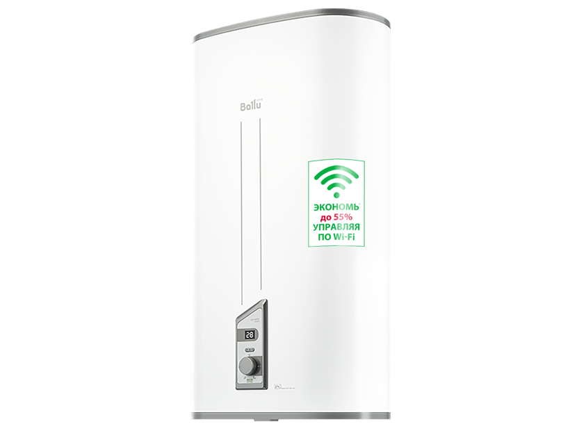
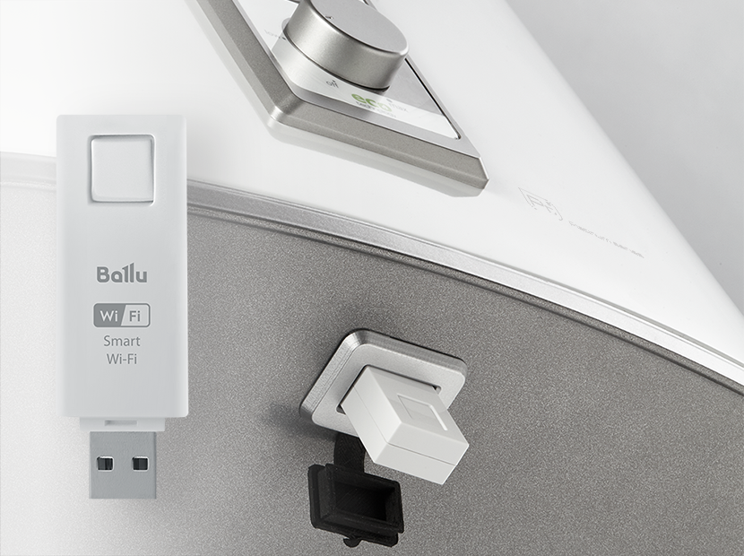

# ioBroker.balluboiler

[](https://www.npmjs.com/package/iobroker.balluboiler)
[](https://www.npmjs.com/package/iobroker.balluboiler)


[](https://david-dm.org/medjaiiii/iobroker.balluboiler)
[](https://snyk.io/test/github/medjaiiii/ioBroker.balluboiler)

[](https://nodei.co/npm/iobroker.balluboiler/)

## balluboiler adapter for ioBroker

Ballu boiler
Адаптер для водонагревателей Ballu серии SMART моделей BWH/S Smart WIFI,[например этот](https://www.ballu.ru/catalog/tekhnika_dlya_doma_i_ofisa/vodonagrevateli/elektricheskie_nakopitelnye_s_bakom_iz_nerzhaveyushchey_stali/smart/vodonagrevatel_ballu_bwh_s_50_smart_wifi/)
Для работы с адаптером необходим самодельный ESP контролер(Wemos(у него есть 5в пин на борту или другой).
На ESP необходимо залить [скетч](https://github.com/medjaiiii/ioBroker.balluboiler/blob/main/ESP/wifi_serial/wifi_serial.ino) через ардуино предварительно отредактировав и указав параметры wifi.
К адаптеру припаивается USB разъем(на TX белый провод, на RX зеленый провод). 
Устанавливаем адаптер и в настройках прописываем IP адрес устройства.


Adapter for Ballu SMART series water heaters models BWH/S Smart WIFI[for example this](https://www.ballu.ru/catalog/tekhnika_dlya_doma_i_ofisa/vodonagrevateli/elektricheskie_nakopitelnye_s_bakom_iz_nerzhaveyushchey_stali/smart/vodonagrevatel_ballu_bwh_s_50_smart_wifi/)
To work with the adapter, you need a self-made ESP controller (Wemos(it has a 5V pin on board or another).
On the ESP you need to fill in the [sketch](https://github.com/medjaiiii/ioBroker.balluboiler/blob/main/ESP/wifi_serial/wifi_serial.ino) via Arduino after editing and specifying the wifi parameters.
The USB connector is soldered to the adapter(on the TX white wire, on the RX green wire).
Install the adapter and specify the IP address of the device in the settings.





### Publishing the adapter
Since you have chosen GitHub Actions as your CI service, you can 
enable automatic releases on npm whenever you push a new git tag that matches the form 
`v<major>.<minor>.<patch>`. The necessary steps are described in `.github/workflows/test-and-release.yml`.

To get your adapter released in ioBroker, please refer to the documentation 
of [ioBroker.repositories](https://github.com/ioBroker/ioBroker.repositories#requirements-for-adapter-to-get-added-to-the-latest-repository).

### Test the adapter manually on a local ioBroker installation
In order to install the adapter locally without publishing, the following steps are recommended:
1. Create a tarball from your dev directory:  
    ```bash
    npm pack
    ```
1. Upload the resulting file to your ioBroker host
1. Install it locally (The paths are different on Windows):
    ```bash
    cd /opt/iobroker
    npm i /path/to/tarball.tgz
    ```

For later updates, the above procedure is not necessary. Just do the following:
1. Overwrite the changed files in the adapter directory (`/opt/iobroker/node_modules/iobroker.balluboiler`)
1. Execute `iobroker upload balluboiler` on the ioBroker host

## Changelog

### 0.0.1
* (medjai) initial release

## License
MIT License

Copyright (c) 2021 medjai <medjai@inbox.ru>

Permission is hereby granted, free of charge, to any person obtaining a copy
of this software and associated documentation files (the "Software"), to deal
in the Software without restriction, including without limitation the rights
to use, copy, modify, merge, publish, distribute, sublicense, and/or sell
copies of the Software, and to permit persons to whom the Software is
furnished to do so, subject to the following conditions:

The above copyright notice and this permission notice shall be included in all
copies or substantial portions of the Software.

THE SOFTWARE IS PROVIDED "AS IS", WITHOUT WARRANTY OF ANY KIND, EXPRESS OR
IMPLIED, INCLUDING BUT NOT LIMITED TO THE WARRANTIES OF MERCHANTABILITY,
FITNESS FOR A PARTICULAR PURPOSE AND NONINFRINGEMENT. IN NO EVENT SHALL THE
AUTHORS OR COPYRIGHT HOLDERS BE LIABLE FOR ANY CLAIM, DAMAGES OR OTHER
LIABILITY, WHETHER IN AN ACTION OF CONTRACT, TORT OR OTHERWISE, ARISING FROM,
OUT OF OR IN CONNECTION WITH THE SOFTWARE OR THE USE OR OTHER DEALINGS IN THE
SOFTWARE.